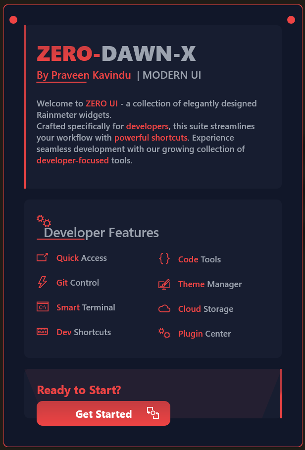
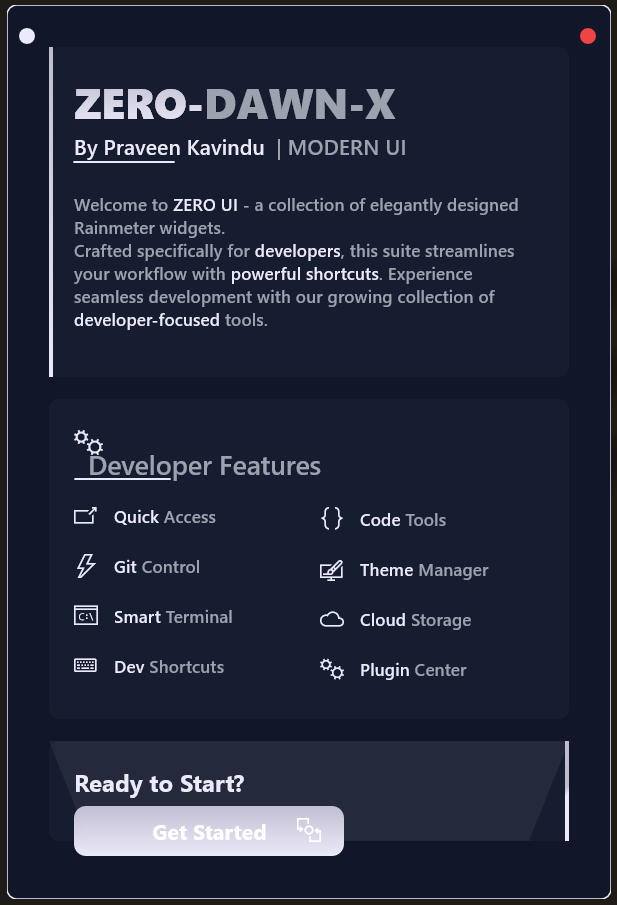
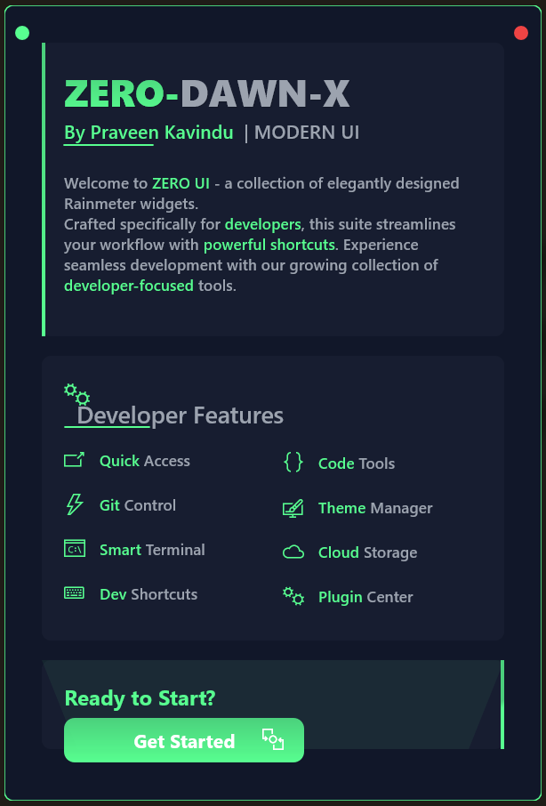
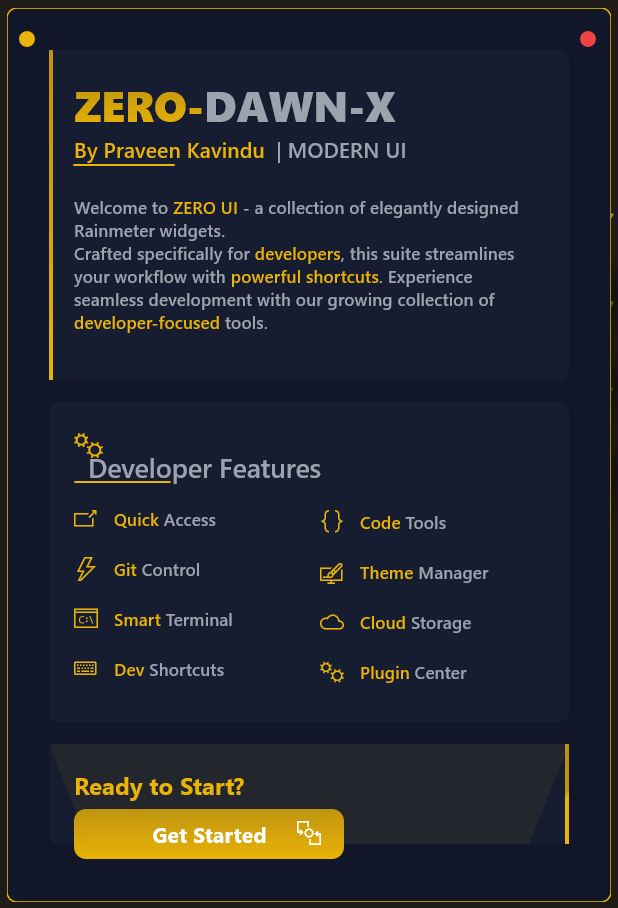
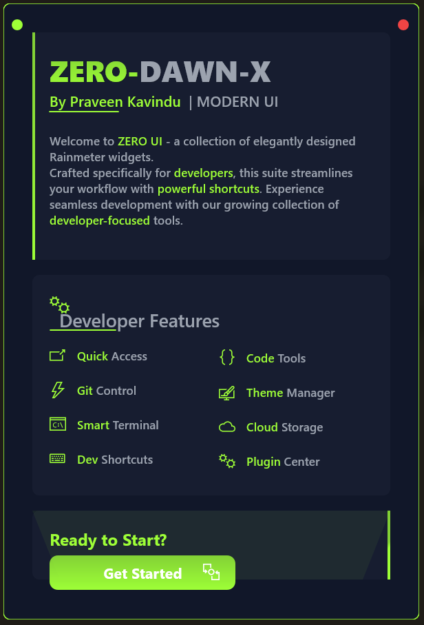
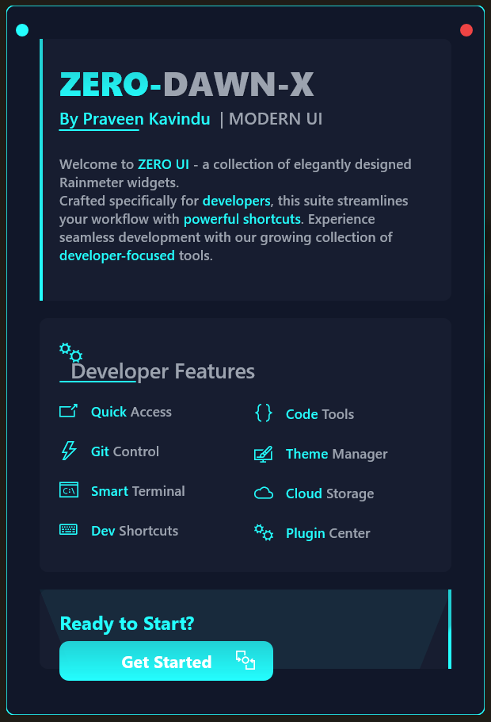
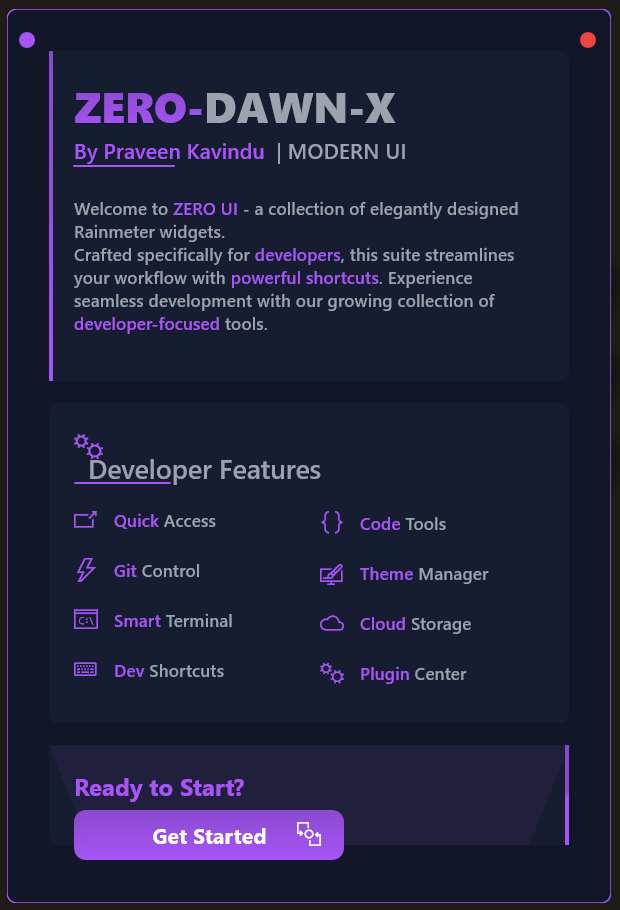
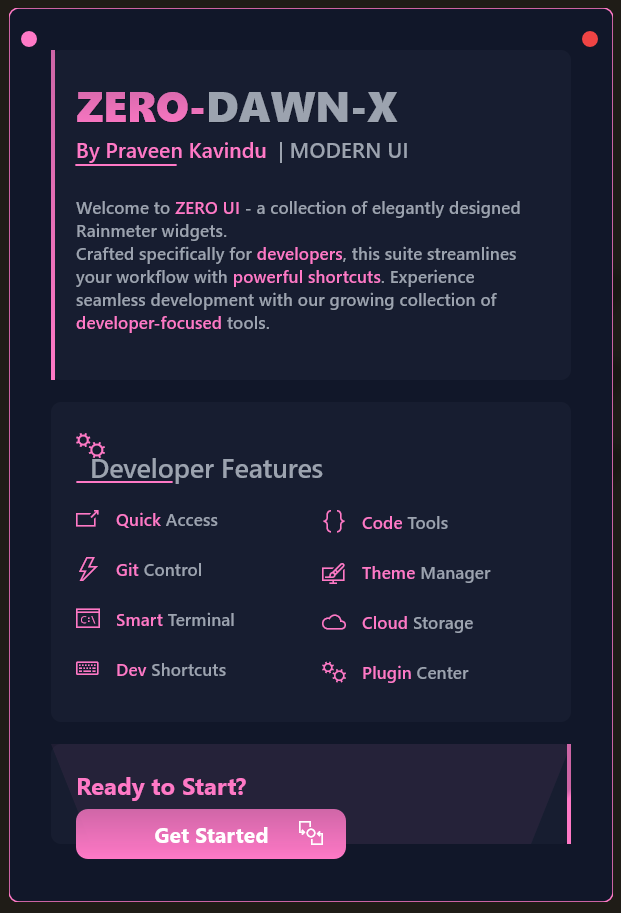

<div align="center">
  <picture>
    <source media="(prefers-color-scheme: dark)" srcset="assets/logo-dark.png">
    <source media="(prefers-color-scheme: light)" srcset="assets/logo-light.png">
    
  </picture>

  # ZERO-DAWN-X Development Suite
  
  <p align="center">
    A comprehensive development environment with elegant UI for full-stack developers
    <br />
    <b>One Suite. All Tools. Maximum Productivity.</b>
    <br /><br />
    <a href="#features">Features</a>
    ·
    <a href="#installation">Installation</a>
    ·
    <a href="#customization">Customization</a>
    ·
    <a href="#screenshots">Screenshots</a>
  </p>

  
  
  
</div>

## 🚀 The Ultimate Developer Dashboard

ZERO-DAWN-X is more than just a Rainmeter skin - it's your complete development command center. Designed for full-stack developers, DevOps engineers, and system administrators who demand both functionality and aesthetics.

### 🎯 Why ZERO-DAWN-X?

- 🔥 **All-in-One Solution** - Everything from API testing to server monitoring
- 🎨 **Premium UI/UX** - Meticulously crafted interface with smooth animations
- ⚡ **Performance Focused** - Lightweight yet powerful, optimized for productivity
- 🛠️ **Extensive Toolset** - Complete development toolkit at your fingertips
- 🌐 **Full-Stack Ready** - Support for multiple technologies and frameworks
- 🔐 **Secure by Design** - Built with security best practices

## 💻️ Screenshots

<div align="center">
  <div style="display: grid; grid-template-columns: repeat(4, 1fr); gap: 20px; padding: 20px;">
    
    
    
    
  </div>
  
  <div style="display: grid; grid-template-columns: repeat(4, 1fr); gap: 20px; padding: 20px;">
    
    
    
    
  </div>
</div>

## 🚀 Feature Arsenal

### 🌐 Frontend Development
- Live preview with hot reload
- CSS preprocessor support
- Component library integration
- Asset optimization tools
- Responsive design testing
- Framework templates (React, Vue, Angular)

### ⚙️ Backend Development
- API endpoint testing
- Database management
- Server health monitoring
- Microservices dashboard
- Cache management
- Service discovery tools

### 🔧 DevOps Tools
- Docker container management
- CI/CD pipeline monitoring
- Kubernetes cluster overview
- Log aggregation
- Performance metrics
- Deployment controls

### 🔐 Security Features
- SSL certificate monitoring
- Security scan results
- Authentication status
- Firewall rules management
- Access log monitoring
- Security alert center

### 📊 Analytics & Monitoring
- Real-time performance graphs
- Error tracking
- User session analytics
- Resource utilization
- Response time monitoring
- Custom metric tracking

### 🛠️ Development Tools
- Git repository management
- Code quality metrics
- Package manager integration
- Terminal access
- Database GUI
- API documentation

## 🖼️ Screenshots

<div align="center">
  <div style="display: grid; grid-template-columns: repeat(4, 1fr); gap: 20px; padding: 20px;">
    
    
    
    
  </div>
  
  <div style="display: grid; grid-template-columns: repeat(4, 1fr); gap: 20px; padding: 20px;">
    
    
    
    
  </div>
</div>

## 🚀 Features

### 💻 Developer Tools
- Quick terminal access
- Git repository controls
- Code snippet manager
- Development shortcuts

### 🎨 Customization
- 35+ premium color themes
- Customizable layouts
- Neon effect intensity control
- Font customization

### ⚡ Quick Access
- Project shortcuts
- Development tools
- Cloud storage
- Plugin center

## 📥 Installation

1. **Prerequisites**
   - Rainmeter 4.5 or higher
   - Windows 10/11

2. **Installation Steps**
   ```bash
   1. Download the latest release
   2. Run the .rmskin installer
   3. Load the skin through Rainmeter
   ```

## 🎨 Customization

### Color Themes
Choose from our extensive collection of 35+ carefully curated color themes:

<div align="center">
  
</div>

### Layout Options
Customize the layout to match your workflow:
- Compact Mode
- Extended View
- Developer Layout
- Minimal Interface

## ⚙️ Configuration

Access the settings through the theme button:
- 🎨 Theme selection
- 📐 Layout options
- 🔧 Widget settings
- ⚡ Performance modes

## 📄 License

This project is licensed under the Creative Commons BY-NC-SA 4.0 - see the [LICENSE](LICENSE) file for details.

## 🤝 Contributing

Contributions are welcome! Please feel free to submit a Pull Request.

## 💖 Support

If you find this project helpful, please consider giving it a ⭐️ on GitHub!

## 📞 Contact

Praveen Kavindu - [@praveenkavindu](https://twitter.com/praveenkavindu)

---

<div align="center">
  Made with ❤️ by <a href="https://github.com/praveenkavindu">Praveen Kavindu</a>
</div>
